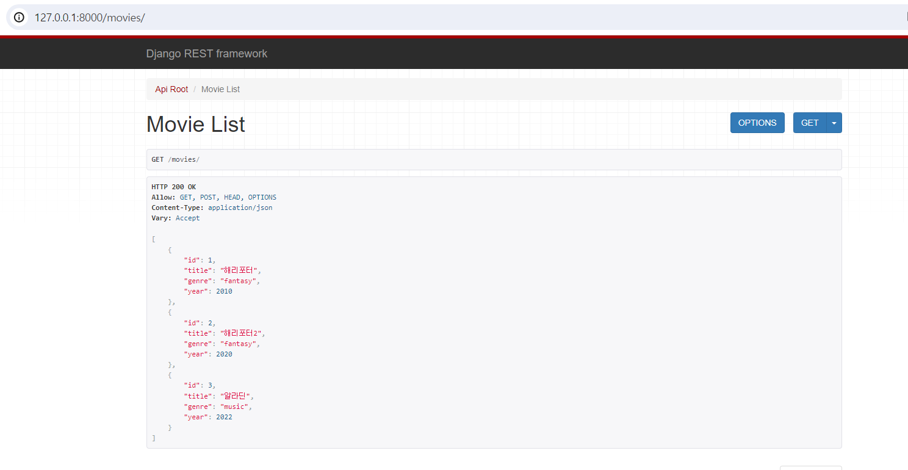

# Django RestFramework 

1. 가상환경 설치, 활성화
```python3 -m virtualenv venv```
```source ./venv/bin/activate```

2. DRF 설치 
```pip install djangorestframework```


3. setting.py 에 추가
``` python
INSTALLED_APPS = [
    ...
    'rest_framework',
    ...
]
```
<br>

---
### RESTful API 구현 연습 예시
</img><br/>